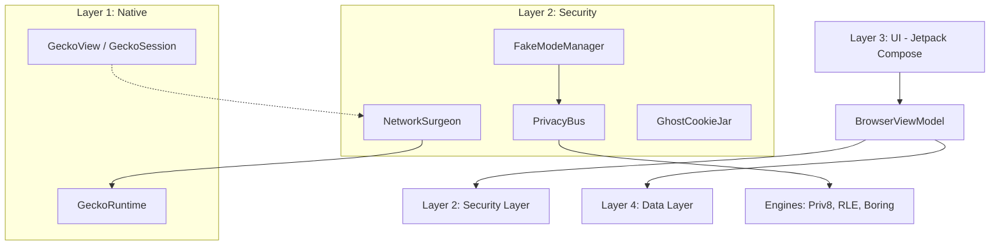

# JusBrowse: Technical Documentation (Alpha 6 / v0.0.6)

## 1. Overview
JusBrowse is a high-security, privacy-focused Android web browser built with Jetpack Compose. It is a **GeckoView-based** browser, employing advanced techniques typically found in anti-detect browsers or cybersecurity research tools to protect user identity and prevent fingerprinting.

---

## 2. System Architecture
JusBrowse follows a multi-layered architectural pattern to separate UI, business logic, and security enforcement.

---

## 3. Core Features & Capabilities

### 🛡️ Deep Privacy Protection
*   **Fake Mode & Personas**: Users can select "Golden Profiles" (e.g., Pixel 8 Pro, Galaxy S24 Ultra). JusBrowse then spoofs every identifiable metric (User-Agent, Screen Size, Battery Level, GPU Renderer, CPU Cores, RAM) to match that profile perfectly via GeckoView arguments and WebExtension injection.
*   **Fingerprinting Protection**: Powered by GeckoView's `resistFingerprinting` and JusBrowse's custom WebExtension. Dynamic JS injection intercepts and "glows" sensitive APIs (Canvas, AudioContext, WebRTC, Client Hints) to prevent tracking.
*   **Network Interception (Network Surgeon)**: Unlike the legacy WebView stack, GeckoView provides a more secure and isolatable network engine. JusBrowse enforces HTTPS-only and strips tracking headers at the source.
*   **Ghost Cookie Jar**: Implements per-tab cookie isolation using GeckoView's `contextId`. Cookies from one tab or persona never leak to another.
*   **Bridge Randomization**: The JavaScript bridges used for communication between the web and native layers are randomized per session, making it impossible for sites to detect the browser's presence.

### 🚀 Performance & Connectivity
*   **GeckoView Engine**: Uses the Firefox rendering engine for superior privacy, security, and standards support.
*   **DNS-over-HTTPS (DoH)**: All DNS queries are routed through secure, encrypted providers (like Cloudflare) directly integrated into the GeckoRuntime.
*   **Persona Isolation**: Each persona runs with its own isolated session and data context, ensuring OS-level and engine-level isolation.

### 🎨 Premium User Experience
*   **Freeform Workspace**: A desktop-like multi-view mode where tabs appear as draggable, resizable windows.
*   **Airlock Media System**: A powerful media extractor that pulls images, videos, and audio from any page into a clean, glassmorphic gallery for viewing or downloading.
*   **Glassmorphism UI**: High-fidelity interface using translucency, blur effects, and smooth animations (Material 3 Expressive).
*   **Sticker Start Page**: A customizable home screen where users can add interactive widgets and shortcuts.

---

## 4. How It Works (Technical Deep-Dive)

### 🩺 Network Surgeon & Interception
The `NetworkSurgeon` provides a clean networking environment.
1.  **Surgery**: Enforces persona-consistent headers (Client Hints, User-Agent) via the `GeckoRuntime` arguments and internal delegates.
2.  **Disguise**: Injects JS to hide the real browser engine's fingerprint.
3.  **Isolation**: Uses `GhostCookieJar` for memory-only cookie storage (when applicable).

### 🎭 Privacy Bus & Engines
When a page loads, JusBrowse injects a sophisticated protection script generated by `FakeModeManager` via the `PrivacyBus` and a built-in WebExtension.
*   **Priv8 Engine**: Flattens real device data into generic "buckets."
*   **RL Engine (RLE)**: "Glows" the flattened data by applying the selected Persona's characteristics.
*   **Boring Engine**: Provides a stable, low-entropy identity for standard protection.
*   **Surgical Injection**: Use of `Mulberry32` deterministic PRNG ensures that noise added to Canvas or Audio APIs is stable for the session.

### 📂 Data Isolation
JusBrowse utilizes gecko sessions with distinct `contextId` values. This ensures that the engine itself keeps data strictly separate. History and Bookmarks are stored in a Room database (`BrowserDatabase`), which is also partitioned by Persona ID.

---

## 5. Security Protocols
*   **Stealth Mimicry**: Never uses "fixed" values that are easily flaggable. Instead, it mimics real device variance.
*   **No-Telemetry Policy**: 100% offline-first. No analytics or tracking data ever leaves the device. GeckoView's internal telemetry is explicitly disabled.
*   **HTTPS Enforcement**: Native HTTPS-only mode enforced via GeckoRuntime.

---

## 6. Glossary of Components
*   **`GeckoWebView.kt`**: A custom wrapper around GeckoView providing the primary browsing interface.
*   **`AddressBarWithGeckoView.kt`**: The combination address bar and engine view for single-tab browsing.
*   **`FreeformWorkspace.kt`**: Implements the drag-and-drop multi-view window logic.
*   **`AirlockGallery.kt`**: The UI for viewing extracted media.
*   **`PrivacyBus.kt`**: The central coordinator for data "glow" and flattening.
*   **`BrowserMessageDelegate.kt`**: Handles communication between WebExtensions and the native app.
